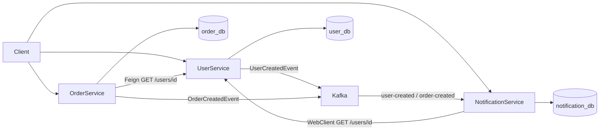

# Event-Driven E-Commerce Microservices

A learning project for **Java / Spring Boot microservice interviews**. It implements three independently runnable Spring Boot 3 services that talk to each other with:

| Mechanism | Where | Style | Why it is used here |
| --- | --- | --- | --- |
| **OpenFeign** | `order-service` → `user-service` | Synchronous, declarative HTTP | Order creation **must wait** for "does this user exist?" before writing to `order_db`. |
| **WebClient** | `notification-service` → `user-service` | Asynchronous / non-blocking HTTP | Fetching user details is I/O bound; WebClient returns a `Mono` and does not need a blocking client. |
| **Apache Kafka** | user/order services → `notification-service` | Asynchronous events | Notifications are a side effect. The create-user / create-order HTTP call should not wait for email/log processing. |

Stack: **Java 17**, **Spring Boot 3.4.5**, **Spring Cloud OpenFeign 2024.0.1**, **Spring Data JPA / Hibernate**, **PostgreSQL**, **Apache Kafka (KRaft, no Zookeeper)**.

---

## 1. Project architecture



Each service is a separate Maven module with its own `pom.xml`, process, port, and database.

```
event-driven-ecommerce-microservices/
├── docker-compose.yml          # PostgreSQL + Kafka (KRaft)
├── init-db.sql                 # creates user_db, order_db, notification_db
├── README.md
├── user-service/               # port 8081
├── order-service/              # port 8082
└── notification-service/       # port 8083
```

Layering inside every service:

```
controller → service → repository
                 ↘ producer / client
dto, entity, event, config, exception
```

Controllers never expose JPA entities. Dependencies are injected through constructors (`final` fields).

---

## 2. Each microservice

### user-service (`8081`)

- Source of truth for users (`User`: `id`, `name`, `email`) stored in **`user_db`**.
- REST: `POST /users`, `GET /users/{id}`, `GET /users`.
- After a successful insert, publishes **`UserCreatedEvent`** to Kafka topic **`user-created`**.

### order-service (`8082`)

- Source of truth for orders stored in **`order_db`**.
- REST: `POST /orders`, `GET /orders/{id}`, `GET /orders`.
- Before insert, calls **`UserClient`** (OpenFeign) to verify the user. HTTP 404 from user-service becomes `UserNotFoundException`.
- After insert, publishes **`OrderCreatedEvent`** to **`order-created`**.

### notification-service (`8083`)

- Owns notification records in **`notification_db`** (never reads `user_db` or `order_db`).
- Kafka consumers in group `notification-group` persist a log row for each event.
- `GET /notifications/user/{userId}` uses **WebClient** to load the user from user-service, then attaches stored notifications.

---

## 3. Why separate databases?

This is the **Database-per-Service** pattern.

- Services can change schema without coordinating a shared migration.
- A slow query in orders cannot lock user tables.
- You can scale or restore one service without restoring everything.
- The public contract becomes APIs and events, not SQL.

The trade-off is that joins across users and orders are no longer SQL joins. This project shows the usual replacements: **sync HTTP** for an immediate decision, **events** for eventual side effects.

---

## 4. WebClient vs FeignClient

| | OpenFeign (`order-service`) | WebClient (`notification-service`) |
| --- | --- | --- |
| API | Java interface + annotations | Fluent builder |
| Threading | Blocking (the caller thread waits) | Non-blocking (`Mono` / `Flux`) |
| Best when | Simple request/response orchestration | High concurrency, reactive pipelines, streaming |
| Internals | Proxy → HTTP client (Java 11+ / Apache) | Reactor Netty event loop |

**Decision in this repo:** creating an order is a transaction that is invalid without a user, so Feign is easier to read than a reactive chain. Enriching a notification view is a read that can stay reactive, so WebClient is used.

Neither service uses `RestTemplate` (maintenance mode).

---

## 5. Kafka communication

Topics:

| Topic | Event | Publisher | Consumer |
| --- | --- | --- | --- |
| `user-created` | `UserCreatedEvent` (`userId`, `name`, `email`) | `UserEventProducer` | `UserCreatedEventConsumer` |
| `order-created` | `OrderCreatedEvent` (`orderId`, `userId`, `productName`, `quantity`, `price`) | `OrderEventProducer` | `OrderCreatedEventConsumer` |

Serialization: **JSON**. Producers set `spring.json.add.type.headers=false` so payloads are language-agnostic. Consumers set `spring.json.use.type.headers=false` and `spring.json.value.default.type=...` **per listener**, because the two topics map to different classes.

The record **key** is `userId` so events for the same user go to the same partition (per-key ordering).

---

## 6. Synchronous vs asynchronous communication

- **Synchronous (Feign / WebClient):** the caller sends HTTP and continues only after a response (WebClient still models that as a `Mono`, but it is still request/response).
- **Asynchronous (Kafka):** the producer writes to a topic and returns. Consumers process later, possibly on another machine, possibly after a retry.

Use sync when the caller **cannot** complete the use case without the answer (user must exist). Use async when the work is a **reaction** (send a welcome notification).

---

## 7. Complete request flows

### Flow 1 — Create user

```text
Client
  → POST /users  (user-service:8081)
  → INSERT user_db
  → Kafka topic user-created  (UserCreatedEvent)
  → notification-service consumer
  → INSERT notification_db + log
```

### Flow 2 — Create order

```text
Client
  → POST /orders  (order-service:8082)
  → OpenFeign GET http://localhost:8081/users/{userId}
  → if 404: HTTP 404 to client (order is not saved)
  → INSERT order_db (status = CREATED)
  → Kafka topic order-created
  → notification-service consumer
```

### Flow 3 — Notification view (WebClient)

```text
Client
  → GET /notifications/user/1  (notification-service:8083)
  → WebClient GET http://localhost:8081/users/1
  → SELECT notifications for user 1 from notification_db
  → JSON { user, notifications[] }
```

---

## 8. How to start PostgreSQL and Kafka

Docker Desktop (or another Compose runtime) must be running.

```bash
cd event-driven-ecommerce-microservices
docker compose up -d
```

This starts:

- PostgreSQL on **5432** with databases `user_db`, `order_db`, `notification_db` (user/password `postgres` / `postgres` — local demo only).
- Kafka on **9092** in **KRaft** mode (no Zookeeper).

Check:

```bash
docker compose ps
```

If Postgres was started before `init-db.sql` existed, remove the volume once: `docker compose down -v` then `docker compose up -d`.

---

## 9. How to run each microservice

Requirements: **JDK 17**. Maven 3.9 is used via the commands below (install Maven, or use IntelliJ's bundled Maven).

From three terminals, after infrastructure is up:

```bash
cd user-service
mvn spring-boot:run
```

```bash
cd order-service
mvn spring-boot:run
```

```bash
cd notification-service
mvn spring-boot:run
```

Each process is independent. `order-service` can start even if `user-service` is down; order **creation** will then return **502 Bad Gateway** until user-service is reachable. Kafka topic creation happens when a producer/admin bean starts (auto-create is also enabled on the broker).

---

## 10. Example API requests

Create a user:

```bash
curl -X POST http://localhost:8081/users ^
  -H "Content-Type: application/json" ^
  -d "{\"name\":\"Rajnish\",\"email\":\"rajnish@example.com\"}"
```

List / get users:

```bash
curl http://localhost:8081/users
curl http://localhost:8081/users/1
```

Create an order (fails with 404 if user `1` does not exist):

```bash
curl -X POST http://localhost:8082/orders ^
  -H "Content-Type: application/json" ^
  -d "{\"userId\":1,\"productName\":\"Laptop\",\"quantity\":2,\"price\":75000}"
```

Notification view (WebClient → user-service):

```bash
curl http://localhost:8083/notifications/user/1
```

Error body shape:

```json
{
  "timestamp": "2026-09-19T08:00:00Z",
  "status": 404,
  "message": "User not found with id: 10",
  "path": "/users/10"
}
```

---

## 11. Example Kafka messages

`user-created`:

```json
{
  "userId": 1,
  "name": "Rajnish",
  "email": "rajnish@example.com"
}
```

`order-created`:

```json
{
  "orderId": 1,
  "userId": 1,
  "productName": "Laptop",
  "quantity": 2,
  "price": 75000
}
```

Watch topics (optional, from the Kafka container):

```bash
docker exec -it ecommerce-kafka kafka-console-consumer.sh --bootstrap-server localhost:9092 --topic user-created --from-beginning
```

---

## 12. How to test the complete flow

1. `docker compose up -d` and wait until Kafka/Postgres are healthy.
2. Start the three Spring Boot apps.
3. `POST /users` → expect **201** and a row in `user_db`.
4. Watch `notification-service` logs for `Received UserCreatedEvent`.
5. `GET /notifications/user/1` → `user` from user-service plus a `USER_CREATED` notification.
6. `POST /orders` for that `userId` → **201**.
7. Repeat GET notifications → additional `ORDER_CREATED` row.
8. `POST /orders` with a fake `userId` → **404**, no Kafka message, no order row.

Automated tests (no Docker required):

```bash
cd user-service && mvn test
cd order-service && mvn test
cd notification-service && mvn test
```

Unit tests cover services, MVC controllers, mocked Feign, MockWebServer-backed WebClient, and Kafka producer/consumer classes.

---

## Design notes (simple production-appropriate choices)

- **No API gateway / Eureka** on purpose. URLs are in `application.yml` so the HTTP vs Kafka story stays obvious.
- **No shared library** for events. Duplicate record classes keep services independently releasable; in a company you might extract a versioned Avro/JSON schema instead.
- **`ddl-auto: update`** is for learning. Production should use Flyway/Liquibase.
- **Kafka publish after DB commit** is not using the transactional outbox. If Kafka is down, the HTTP call still succeeds and the event is only logged as a failure. Interview follow-up: outbox table + poller, or Kafka transactions.
- Passwords live in YAML for the demo, not in Java. Use env vars or a secret manager in production (`SPRING_DATASOURCE_PASSWORD`).

---

## Interview Questions

### 1. What is microservice architecture?

An application split into independently deployable services, each owning a business capability (users, orders, notifications). Teams can deploy, scale, and fail in isolation. Complexity moves into **network communication, data consistency, and operations**.

### 2. Why should microservices have separate databases?

So schema and data lifecycle match the service boundary. Sharing a database couples services: one change or lock can break another team. Integration should happen through APIs and events.

### 3. WebClient vs FeignClient?

Feign is a **declarative blocking** HTTP client (interface + annotations). WebClient is a **reactive non-blocking** client that returns `Mono`/`Flux`. Feign optimizes for readable sync orchestration; WebClient optimizes for concurrency and reactive composition.

### 4. When would you use WebClient?

When you want non-blocking I/O, many concurrent outbound calls, streaming, or you are already on WebFlux. Also when you need fine-grained control of filters, timeouts, and backpressure.

### 5. When would you use FeignClient?

When the call is a straightforward sync dependency (validate user, fetch config) and the team prefers an interface that looks like a Java method. It shines with Spring Cloud (load balancing, interceptors).

### 6. What is synchronous communication?

The caller waits for a response in the same request flow. HTTP Feign in `order-service` is synchronous: no order until user-service answers.

### 7. What is asynchronous communication?

The caller does not wait for the downstream processor. Kafka publish returns after the broker accepts the record (depending on `acks`), not after notification-service finishes.

### 8. Why use Kafka?

Durable, scalable pub/sub with consumer groups, replay, and per-partition ordering. Producers and consumers are decoupled in time and topology — multiple consumers can react to `order-created` later (notifications, analytics, inventory).

### 9. What happens if Kafka is temporarily unavailable?

With this demo code, `KafkaTemplate.send` fails asynchronously and is logged; the HTTP request may still return 201 after the DB write. Messages are not automatically recovered unless you add retry/outbox. If the **consumer** is down, records stay on the topic until it resumes (`auto-offset-reset=earliest` only applies when there is no committed offset).

### 10. What is a Kafka topic?

A named log of records (e.g. `user-created`). Producers append; consumers read. Topics are split into partitions.

### 11. What is a Kafka partition?

An ordered, append-only sequence inside a topic. Partition count limits consumer parallelism in a group and is the unit of ordering.

### 12. What is a Kafka consumer group?

A set of consumers sharing a `groupId`. Kafka assigns partitions so **each record is processed by one member** of that group. A second group on the same topic gets its own copy (fan-out).

### 13. What happens if there are more consumers than partitions?

Extra consumers in that group stay idle. Throughput does not increase until you add partitions (which can affect key ordering if you re-key).

### 14. How does Kafka guarantee message ordering?

**Only within a partition.** Same key → same partition (with the default partitioner) → same order. There is no total order across partitions.

### 15. What is the difference between Kafka producer and consumer?

Producer writes records (`KafkaTemplate`). Consumer reads them (`@KafkaListener`), commits offsets, and belongs to a group. They scale independently.

### 16. How does Feign communicate internally?

`@EnableFeignClients` creates a JDK proxy for each `@FeignClient`. A method call is encoded (path, headers, body) and executed by an HTTP client. The JSON response is decoded into the return type. Errors become `FeignException`.

### 17. How does WebClient work?

It builds an immutable request, sends it on Reactor Netty, and exposes the response as a reactive publisher. `retrieve().bodyToMono(UserResponse.class)` decodes JSON when the response arrives, without occupying a Tomcat thread for the wait (the MVC thread still waits unless you return the `Mono` from the controller).

### 18. What is reactive programming?

A model based on asynchronous streams and backpressure (Reactive Streams). You describe a pipeline; data flows when subscribed. Spring's implementation is Project Reactor.

### 19. What is `Mono`?

A Reactor publisher of **0 or 1** item (plus error/completion). Used for single HTTP responses.

### 20. What is `Flux`?

A publisher of **0..N** items. Used for lists, SSE, or streaming Kafka/HTTP.

### 21. Why should we avoid sharing databases between microservices?

It breaks encapsulation, creates hidden coupling, complicates ownership, and turns every schema change into a cross-team release. It also encourages joins that prevent independent scaling.

### 22. How would you handle failure between microservices?

Timeouts, retries with jitter, fallbacks, circuit breakers, bulkheads, and **idempotent** consumers. Map dependency outages to 502/503. For Kafka, use DLT (dead-letter topics) after N failures.

### 23. How would you implement retries?

- HTTP: Spring Cloud OpenFeign retryer, Resilience4j `Retry`, or WebClient `retryWhen(Retry.backoff(...))` on 502/503, **not** on 400/404.
- Kafka: consumer `DefaultErrorHandler` with backoff; producers retry transient send errors (`retries` config).

### 24. How would you implement circuit breakers?

Resilience4j CircuitBreaker (or Spring Cloud CircuitBreaker) around Feign/WebClient. After a failure threshold, calls fail fast and optionally hit a fallback until a probe succeeds.

### 25. How would you secure communication between microservices?

mTLS or a service mesh, OAuth2/JWT between services, network policies, least-privilege DB users, Kafka SASL/SSL, and no secrets in source code. An API gateway can terminate user auth; internal calls still need identity (propagated bearer token or SPIFFE).

---

## Quick map of important classes

| Concept | Class |
| --- | --- |
| Feign client | `order-service` `com.example.orderservice.client.UserClient` |
| WebClient | `notification-service` `UserWebClientService` + `WebClientConfig` |
| Kafka produce | `UserEventProducer`, `OrderEventProducer` |
| Kafka consume | `UserCreatedEventConsumer`, `OrderCreatedEventConsumer` |
| Errors | each service `GlobalExceptionHandler` |
